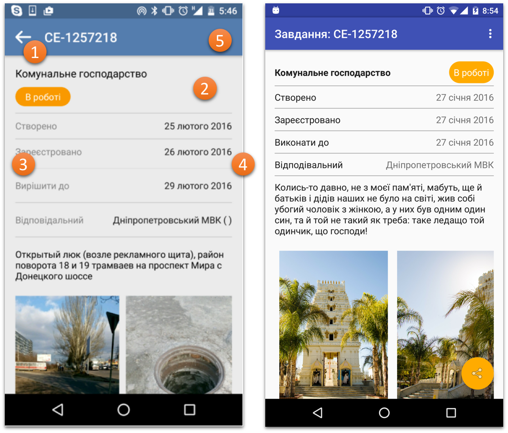

# Yalantis Android Internship Task #1
* Simple static application with a ScrollView, RecyclerView.

## Required behaviour - (build variant: lite version)
* Dimensions, Styles in XML (/res)
* Minimal SDK version = 16
* Only portrait orientation (app should work in a portrait mode at least)
* Image loading through third part library (Picasso in my case)
* Support different screen sizes
* Back button should close the application
* Ukrainian and English localizations should be included
* When user presses any control, show a toast with a control name
* App should conform to [google coding style](https://source.android.com/source/code-style.html)
* UI bug fixes, improvements.

## UI Improvements
1. Back button isn't necessary in 1 Activity program.
2. Too much whitespace.
3. Main text should be visible better.
4. Inconsistent padding between elements.
5. Not required, but always nice to have some settings :)

## Additionally implemented - (build variant: full version)
* API calls to a "backend" and parsing of a JSON reply.
* Main activity with a list of tasks.
* Each task opens a Detail Activity.
* Used libraries: Retrofit, Butterknife, Picasso.
* Floating Action Buttons (share activity).
* Shared Transitions.
