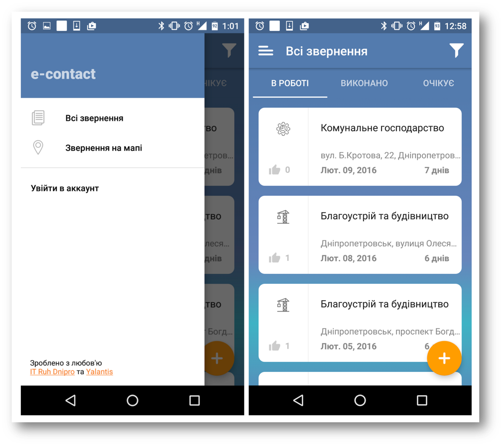

# Yalantis Android Internship Task #2
* Application with a Pager and a Navigation Drawer.

## Screen Design from Specifications

## Requirements
* Create a screen with controls according to the specification.
* The Application should contain 3 Tabs and a Navigation Drawer.
* App should have at least 10 data entries.
* Minimal SDK version = 16.
* No hardcoded values, use styles.
* App should conform to [google coding style](https://source.android.com/source/code-style.html).
* 1 & 2 Tabs should use RecyclerView, 3 Tab - ListView.
* On item click - open first task [Details Activity](../YalantisInternship/).
* Floating Action Button hide on swipe with animation.
* Only portrait orientation.

## Possible improvements
* Use Coordinator layout as a main layout (but then we'll get elevation on TabLayout).
* Make Navigation Drawer narrower (wrap_content).
* Change icons to density independent (place, list, menu)